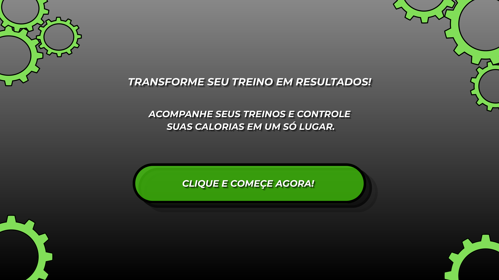
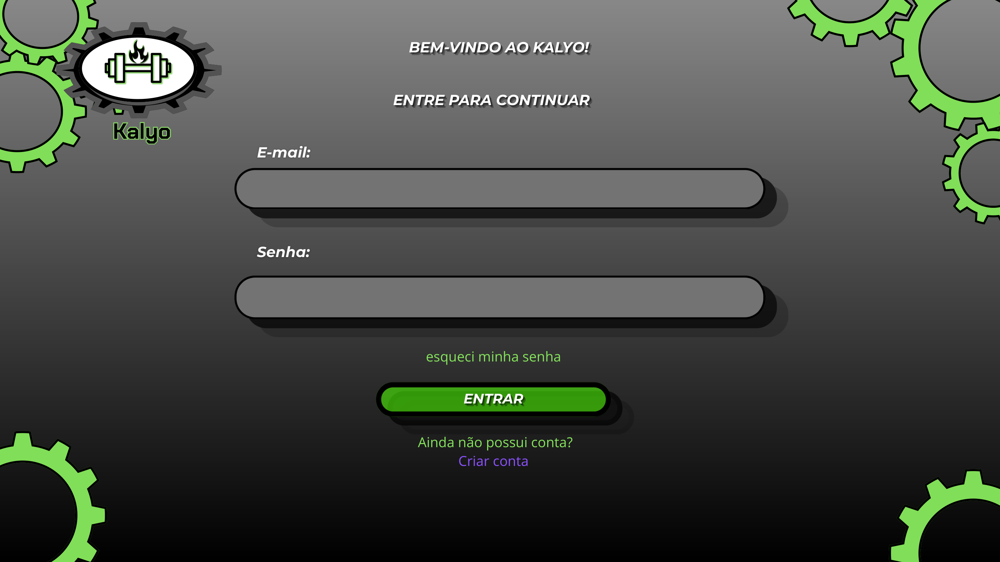
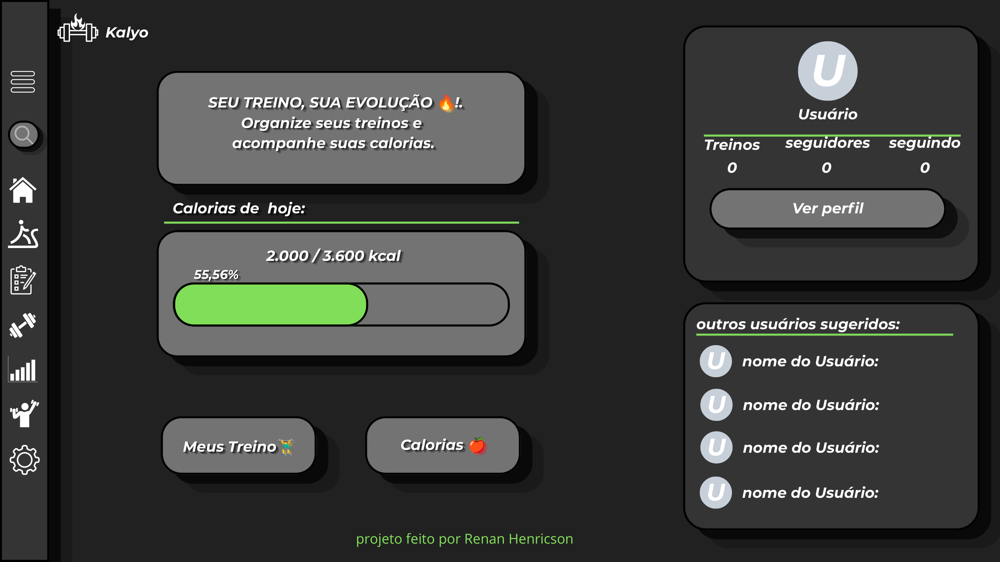
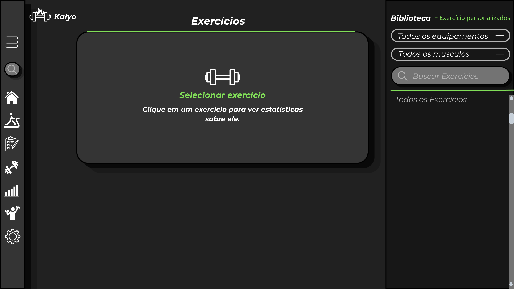

# 🏋️ KALYO
# 🙍‍♂️ Autor: Renan Henricson
Protótipo de um sistema de treino e acompanhamento de calorias.

## 📱 Sobre o projeto

O KALYO é um projeto de aplicativo voltado para organização de treinos, acompanhamento de exercícios e controle de calorias.

A ideia é reunir essas funções em uma interface simples e fácil de usar.

## 🎨 Design

O layout teve como inspiração o aplicativo **Hevy**, principalmente na organização das telas, menus, cartões e biblioteca de exercícios.

O design foi adaptado para a proposta do KALYO, utilizando principalmente preto, cinza, branco e verde.

## 🛠️ Desenvolvimento

O protótipo foi desenvolvido no **Canva**, utilizando formas, textos, ícones, cores e imagens para criar as telas.

## 📸 Telas

As imagens do protótipo estão disponíveis na pasta `assets`.

## 🎯 Objetivo

Criar um protótipo de interface para um aplicativo de treinos e acompanhamento de calorias, praticando conceitos de Web Design e criação de interfaces.

## 📋 Desenvolvimento do projeto

### 💡 Ideia

O KALYO é um projeto de aplicativo voltado para organização de treinos, acompanhamento de exercícios e controle de calorias. A ideia é reunir essas funções em uma interface simples e fácil de usar.

### 🎨 Inspiração e layout

Para criar o layout, utilizei o aplicativo **Hevy** como inspiração, principalmente na organização das telas, menus laterais, cartões e biblioteca de exercícios. O design foi adaptado para a proposta do KALYO.

### 🖌️ Elementos visuais

Foram utilizados principalmente preto, cinza, branco e verde, buscando uma aparência moderna relacionada ao tema fitness. Também foram utilizados ícones, botões e cartões com bordas arredondadas.

### 🛠️ Desenvolvimento

O protótipo foi desenvolvido no **Canva**, utilizando formas, textos, ícones, cores e imagens para criar e organizar as telas.

### Protótipo

As telas abaixo mostram exemplos da interface criada para o Kalyо.
**banner inicial**

 

**tela de login**

**tela inicial**

**tela de exercícios**

